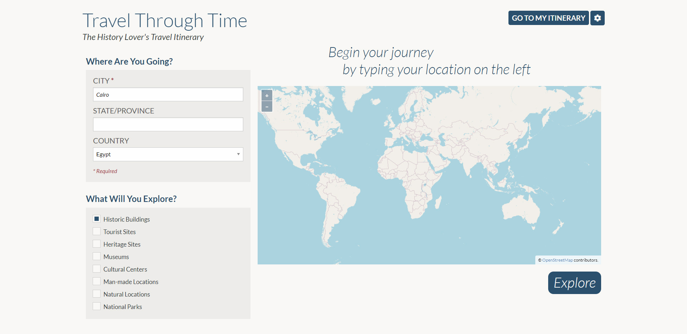
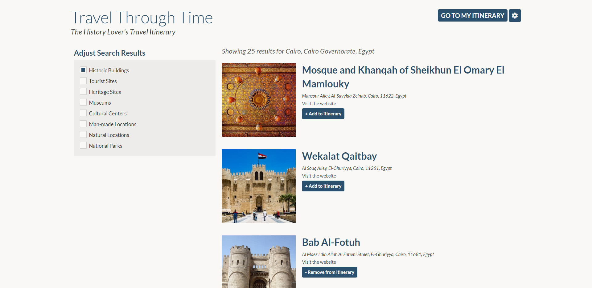
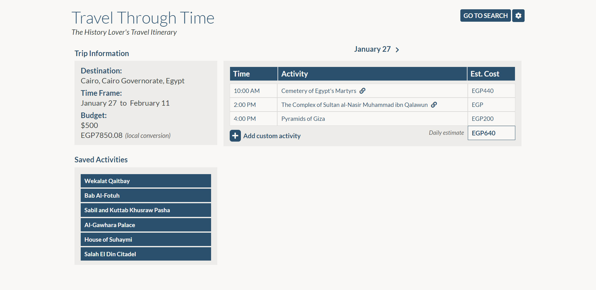

# Travel Itinerary
Our website offers a way to explore the historical sites, monuments, museums, etc anywhere in the world with a click of a button. On the index.html page, or the home page, there are pathways to the itinerary.html and results.html page. In the results page, several APIs are used in order to use the search criteria to find places within the city/state/country the user is searching for. The itinerary page includes the saved activities from the results page as well as a currency exchange, budget and itinerary of the trip. 

The technologies used in order to make this application include: Foundation css framework, JQuery, JQuery UI, several different APIs and Javascript API fetching.

# View Live Page
[View the live Travel Itinerary page on GitHub.](https://jcolecodes.github.io/travel-itinerary-project-01/ )

# Screenshot

